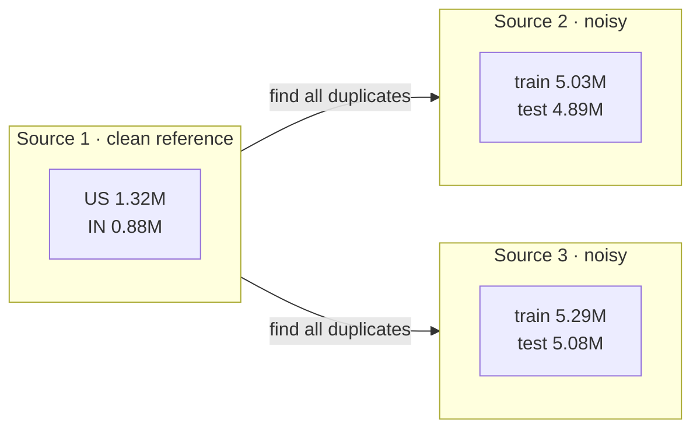
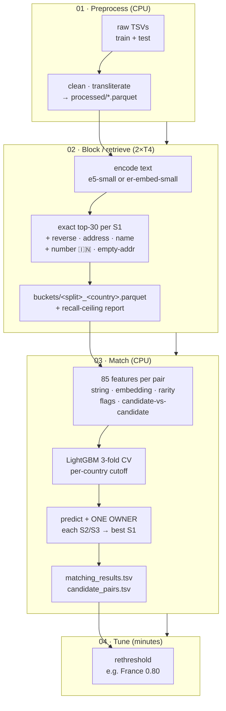
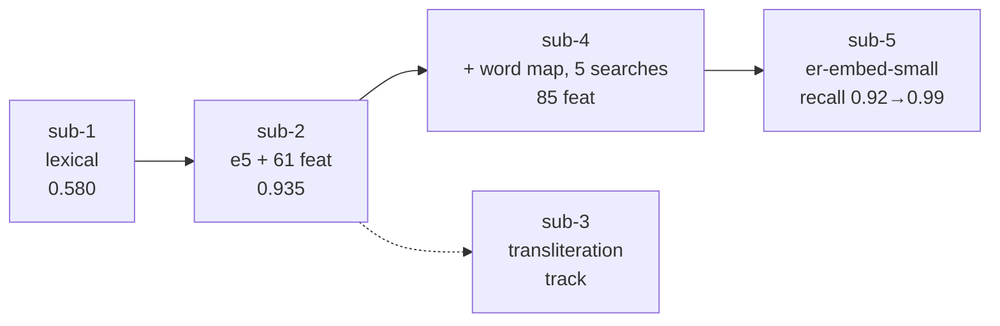

<div align="center">


[](https://github.com/Nikunjgoyal07/Amazon-ML-Challenge-2026)

[](https://www.python.org/)
[](https://pytorch.org/)
[](https://huggingface.co/docs/transformers/)
[](https://pola.rs/)
[](https://lightgbm.readthedocs.io/)
[](https://github.com/facebookresearch/faiss)
[](https://github.com/rapidfuzz/RapidFuzz)
[](https://github.com/anyascii/anyascii)
[](docs/RESULTS_EXPLAINED.md)
[](docs/SUBMISSION_STEPS.md)

[](https://skillicons.dev)

</div>

---

## 🎯 TL;DR

> Given **deduplicated Source 1** businesses and **noisy, duplicate-heavy Sources 2 and 3** that share only
> `business_name`, `business_address`, `country` — no IDs — predict for **every** test S1 business the
> S2/S3 records that are *the same business*. Train has **US + India**; test adds an **unseen France**.
> Scored by **macro F0.5 per S1**: precision counts double, a correct empty list scores **1.0**, and a
> single false match on a singleton scores **0**.

This repo holds **five submissions**, each in its own folder with a **detailed README**:

| Submission | Approach in one line | Reported score | Compute | Detailed write-up |
|---|---|---|---|---|
| **1** | CPU-only: 6-key lexical blocker → 8-feature LightGBM → per-country cutoffs | **0.580046** ⁽¹⁾ | 4 CPU, 35 min | **[submission-1/README.md](submission-1/README.md)** |
| **2** | `multilingual-e5-small` top-30 dense retrieval + 3 extra searches → 61-feature LightGBM + one-owner | **0.935** (public) | 2×T4 + CPU | **[submission-2/README.md](submission-2/README.md)** |
| **3** | Research track: hybrid IndicXlit + anyascii transliteration engine, acceptance-gated, anchored sampling | experiment | Kaggle CPU | **[submission-3/README.md](submission-3/README.md)** |
| **4** | Full current pipeline: word map, 5 candidate searches, **85 features**, France rethreshold | ceiling 0.974 | 2×T4 + CPU | **[submission-4/README.md](submission-4/README.md)** |
| **5** | **`er-embed-small`: our own 23M embedding model** — 32k WordPiece, MLM + contrastive, trained on this data | recall@10 0.92→0.99 | 2×T4 | **[submission-5/README.md](submission-5/README.md)** ⁽²⁾ |

⁽¹⁾ as reported in that branch's own README (a lexical baseline; the later rows are public-leaderboard numbers, so they are not directly comparable).
⁽²⁾ a retriever upgrade, judged by retrieval recall rather than a leaderboard submission.

> The **short version of what we learned**: retrieval decides the ceiling, the matcher converts recall into
> F0.5, and one-owner assignment plus a well-chosen cutoff buy the last precision points.

---

## 🧬 The shape of the problem



| Fact from EDA | Value | Why it matters |
|---|---|---|
| Each S2/S3 record matches **at most one** S1 (max reuse = 1 in 7.6M links) | many-to-one prior | Assignment ("one owner") is a legal constraint, not a heuristic |
| **~26%** of S2/S3 records are distractors matching nothing | — | The main source of false positives |
| Singletons are only **5.6%** of train S1; mean **3.5** matches, max 11 | — | A correct empty list is rare but valuable; false matches are expensive |
| **No cross-country matches** in 7.64M observed links | — | Same-country retrieval is a strong prior (with a documented fallback) |
| **France never appears in train** | domain shift | Every component must be country-agnostic — no country feature in the model |
| Noise is systematic and learnable | — | junk prefixes `***` `(ID:1072)`, honorifics `Smt/Shri`, typos `Wcstgrove`, accent injection, word shuffles, `Pvt/Private`, name→domain (`eelegal.com`), Devanagari names, address-only matches |
| Leakage audit | 0 exact test↔train-S1 overlap; 33.8% of test S1 **names** collide | Name-only lookup is unsafe; the model must use address too |

---

## ⚙️ Architecture at a glance

The full pipeline is four notebooks; each submission folder holds the version of them that was actually run.



**Why this shape?** The closest analogue (Foursquare Location Matching) was won by exactly this
four-stage recipe: wide cheap candidate generation → boosted matcher → expensive re-ranker → graph
consistency. See **[docs/RESEARCH_APPROACHES.md](docs/RESEARCH_APPROACHES.md)** for what we borrowed,
what we skipped, and why.

---

## 💡 The ideas we used

| # | Idea | Where it shows up | Effect |
|---|---|---|---|
| 1 | **Blocking = the ceiling.** Recall of the shortlist bounds the final score no matter how good the matcher is | every submission | Ceiling 0.982 overall, but **0.967 for India** — India is where search, not matching, is the loss |
| 2 | **Lexical keys first** (postcode, house number, first token, prefix, any token, consonant skeleton) | submission-1 | recall@40 0.578 — cheap, explainable, CPU-only |
| 3 | **Dense multilingual retrieval** (`query: name \| address`, fp16, 2×T4) replaces hand keys | submissions 2, 4, 5 | 0.58 → 0.935; US ceiling 0.994 |
| 4 | **Patch the retriever's blind spots** with targeted searches instead of a bigger top-k | submission-4 | reverse, address-key, name 3-grams, India number key, empty-address search — 4–10× cheaper per pair than 30→50 |
| 5 | **One owner per record.** Each S2/S3 goes to its highest-probability S1, never to several | submissions 2, 4 | Turns a per-pair score into a consistent linkage; free precision |
| 6 | **A GBDT matcher on many cheap features** — RapidFuzz ratios, exact flags, embedding rank/gap, word rarity, cross-S1 competition | submissions 1, 2, 4 | 44 → 61 → **85** features; test bed 0.943 → 0.967 |
| 7 | **Transliteration + a learned word map.** Indian scripts → Latin, then a ~370-word map learned from train true pairs (`praivet→private`) | submissions 3, 4 | Hindi name similarity 76 → 91 |
| 8 | **Train the retriever on the domain** — own tokenizer, MLM then contrastive | submission-5 | India recall@10 0.9219 → **0.9872**; empty-address 0.3505 → **0.9111** |
| 9 | **Tune the cutoff, per country, for F0.5** — not for accuracy | all | France has no labels, so its cutoff comes from the leaderboard (`04_rethreshold`) |
| 10 | **No country feature**, so the model transfers to unseen France | submission-4 | Cross-country check loses 0.04–0.06; France ≈ 0.88 |



---

## 📦 Repository map

```text
.
├── README.md                 ← you are here: overview + every submission's link
├── requirements.txt          pinned runtime for notebooks 01–04
├── docs/                     method, runbook, results, file guide  (see below)
├── submission-1/             CPU lexical baseline  → src/*.py
├── submission-2/             first leaderboard submission (0.935)
├── submission-3/             transliteration research track
├── submission-4/             full current pipeline + sample experiment twins
└── submission-5/             er-embed-small from-scratch embedding model
```

| Document | Answers |
|---|---|
| **[docs/ARCHITECTURE.md](docs/ARCHITECTURE.md)** | How does the solution work, and why was it built this way? |
| **[docs/SUBMISSION_STEPS.md](docs/SUBMISSION_STEPS.md)** | How do I run a submission on Kaggle and validate it? |
| **[docs/RESULTS_EXPLAINED.md](docs/RESULTS_EXPLAINED.md)** | What do the printed scores mean? |
| **[docs/DATA_AND_OUTPUTS.md](docs/DATA_AND_OUTPUTS.md)** | What does each folder and output file contain? |
| **[docs/FILES.md](docs/FILES.md)** | What does each file in the repo do? |
| **[docs/PLAN.md](docs/PLAN.md)** | The original plan: options considered, data findings, constraints |
| **[docs/RESEARCH_APPROACHES.md](docs/RESEARCH_APPROACHES.md)** | Literature + winning-solution survey, mapped onto our pipeline |
| **[docs/buckets.md](docs/buckets.md)** | Blocking design: candidate sources, caps, recall measurements |
| **[docs/modifs.md](docs/modifs.md)** | Change log with expected-vs-measured effect of every tweak |
| **[docs/first-preprocessing.md](docs/first-preprocessing.md)** | What the preprocessing run found and did |
| **[docs/hybridplanner.md](docs/hybridplanner.md)** | Transliteration ideas behind submission-3 |
| **[submission-5/WWMD.md](submission-5/WWMD.md)** | 📖 The embedding model explained in plain language |

---

## 🚀 Quick start

```bash
pip install -r requirements.txt          # notebooks 01–04 (Kaggle image ships most of it)
# GPU PyTorch for the T4s:
# pip install torch==2.14.0 --index-url https://download.pytorch.org/whl/cu126
```

Run, in order, on Kaggle (**T4 x2 + internet ON** for notebook 02):

| Step | Notebook | Machine | Output |
|---|---|---|---|
| 1 | [`submission-4/01_eda_preprocessing.ipynb`](submission-4/01_eda_preprocessing.ipynb) with `FULL_RUN=true` | CPU | `processed/` |
| 2 | [`submission-4/02_full_e5_buckets.ipynb`](submission-4/02_full_e5_buckets.ipynb) | 2×T4 | `buckets/` + recall report |
| 3 | [`submission-4/03_full_lightgbm_submission.ipynb`](submission-4/03_full_lightgbm_submission.ipynb) | CPU | `matching_results.tsv`, `candidate_pairs.tsv` |
| 4 | [`submission-4/04_rethreshold.ipynb`](submission-4/04_rethreshold.ipynb) (optional) | CPU | per-country cutoffs |
| ✓ | `python submission-1/utils/validate_submission.py --matching … --candidate … --test-dir dataset/test` | CPU | `PASS` |

Full settings, environment variables, Kaggle attach instructions and the OOM/slow-run escape hatches are in
**[docs/SUBMISSION_STEPS.md](docs/SUBMISSION_STEPS.md)**.

---

## 🧰 Stack

<div align="center">

<a href="https://www.python.org/"></a>
<a href="https://pytorch.org/"></a>
<a href="https://huggingface.co/"></a>
<a href="https://pola.rs/"></a>
<a href="https://lightgbm.readthedocs.io/"></a>
<a href="https://scikit-learn.org/"></a>
<a href="https://github.com/facebookresearch/faiss"></a>
<a href="https://www.rapidfuzz.com/"></a>
<a href="https://kaggle.com/"></a>
<a href="https://jupyter.org/"></a>

<br>

`multilingual-e5-small` · `er-embed-small` (ours) · Polars · pandas · pyarrow · faiss-cpu · torch ·
sentence-transformers · transformers · tokenizers · LightGBM · RapidFuzz · anyascii · scipy ·
scikit-learn · Jupyter

</div>

**License constraints honoured:** final models are MIT / Apache-2.0 and ≤ 8 parameters; `anyascii` (ISC),
`RapidFuzz` (MIT), `LightGBM` (MIT), `polars` (MIT), `sentence-transformers` (Apache-2.0). No external
data or APIs; France handled by a country-agnostic model, not by French training data.

---

## 🔭 What we would do next

1. **Cross-encoder re-rank** the LightGBM's uncertain band only (tens of millions of pairs is infeasible
   wholesale) — the 1st/2nd-place Foursquare route, untried here.
2. **Graph post-processing** — connected components and low-centrality edge removal, plus S2↔S3
   duplicate cleanup, to exploit transitivity.
3. **Ship `er-embed-small` into 02_full** and re-measure the India ceiling (0.967 → ?).
4. **Cross-validated France threshold** instead of a leaderboard-tuned cutoff, and a France-safe
   fallback for unseen countries (already documented, not yet validated on real test data).

---

<details>
<summary>📊 <b>More visuals</b> (repo &amp; profile widgets — safe to delete)</summary>

<div align="center">

[](https://github.com/Nikunjgoyal07/Amazon-ML-Challenge-2026)

[](https://github.com/Nikunjgoyal07)
[](https://github.com/Nikunjgoyal07)
[](https://github.com/Nikunjgoyal07)
[](https://github.com/Nikunjgoyal07)
[](https://github.com/Nikunjgoyal07)

[](https://carbon.now.sh/)
[](https://badgen.net)
[](https://github.com/sindresorhus/awesome)

</div>

</details>

---

## 📎 Credits & references

* Competition: Amazon ML Challenge 2026 — Business Entity Resolution.
* Closest prior art: **Foursquare Location Matching** (Kaggle 2022) write-ups — 1st, 2nd, 3rd, 7th place.
* Method background: [Papadakis et al., *Blocking and Filtering Techniques for Entity Resolution: A Survey* (ACM CSUR 2020)](https://arxiv.org/abs/1905.06167) ·
  [Ditto (VLDB 2021)](https://www.vldb.org/pvldb/vol14/p50-li.pdf) ·
  [DeepBlocker (VLDB 2021)](https://vldb.org/pvldb/vol14/p2459-thirumuruganathan.pdf) ·
  [AnyMatch (2024)](https://arxiv.org/abs/2409.04073) ·
  [Optimal F-score bipartite linkage (2023)](https://arxiv.org/abs/2311.13923).
* Base encoder: [`intfloat/multilingual-e5-small`](https://huggingface.co/intfloat/multilingual-e5-small) (MIT),
  used for evaluation and as the submission-2/4 retriever. Submission-5's `er-embed-small` is trained
  from scratch on this data only.

<div align="center">

*Built with [Readme.so](https://readme.so)-style structure, [ReadmeCodeGen](https://www.readme-code-gen.com/)-style
layout, [Shields.io](https://shields.io), [Skill Icons](https://skillicons.dev) + [Simple Icons](https://simpleicons.org),
[Readme Typing SVG](https://github.com/DenverCoder1/readme-typing-svg), [Capsule Render](https://github.com/kyechan99/capsule-render),
[Mermaid](https://mermaid.js.org), [GitHub Readme Stats](https://github.com/anuraghazra/github-readme-stats),
[Profile Trophy](https://github.com/ryo-ma/github-profile-trophy), [Streak Stats](https://github.com/DenverCoder1/github-readme-streak-stats),
[3D Contrib](https://github.com/0xAshish/Profile-3D-Contrib), [Badgen](https://badgen.net) and
[Carbon](https://carbon.now.sh).*

</div>