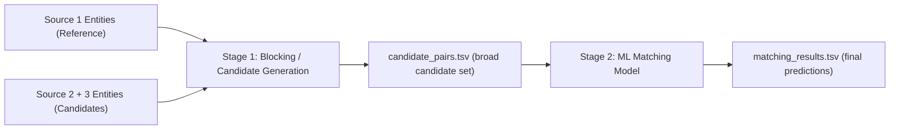

# Amazon ML Challenge 2026 — Detailed Breakdown & Action Plan

---

## 1. What Is the Problem?

### The Core Task: Business Entity Resolution

You are given **business records from 3 independent data sources** (Source 1, Source 2, Source 3). Each record describes a real-world business with fields like `business_name`, `business_address`, and `country`. The records have **no shared identifiers** — the same business can appear in multiple sources with different names, addresses, and formatting.

**Your job**: For every record in **Source 1** (the deduplicated reference), find all the matching records in **Source 2** and **Source 3** that refer to the same real-world business.

> [!IMPORTANT]
> This is **NOT** a classification or regression problem. It is a **record linkage / entity matching** problem. You are essentially building a system that says:
> *"S1-00042 is the same business as S2-00187 and S3-00901"*

### The Real-World Analogy

Imagine Amazon receives business data from 3 vendors. Vendor A calls a company *"Amazon.com Inc."*, Vendor B calls it *"AMAZON COM INC"*, and Vendor C calls it *"Amazon.com, Inc., Seattle, WA"*. Your ML system must figure out that all three refer to the same entity — **without** looking anything up externally.

---

## 2. Data Structure at a Glance

### Source Files (3 per split)

| File | Contents |
|------|----------|
| `train_source1.tsv` / `test_source1.tsv` | **Reference entities** — every S1 entity needs matches |
| `train_source2.tsv` / `test_source2.tsv` | Candidate pool #1 |
| `train_source3.tsv` / `test_source3.tsv` | Candidate pool #2 |

### Columns in Each Source File

| Column | Description | Noise Expected |
|--------|-------------|----------------|
| `entity_id` | Unique ID prefixed `S1-`, `S2-`, or `S3-` | Clean |
| `business_name` | Business name | Abbreviations, typos, DBA names, word-order swaps, punctuation differences (`&` vs `and`) |
| `business_address` | Physical address | Abbreviations (`Rd`/`Road`), missing components (no PIN/ZIP), landmark-based addresses, transliterations |
| `country` | Country label | `US`, `India` in train; **`France` appears only in test** (unseen country!) |

### Ground Truth (train only)

| Column | Description |
|--------|-------------|
| `source1_entity_id` | An S1 entity |
| `matched_entity_ids` | Comma-separated list of matching S2/S3 IDs (can be **empty** = singleton) |

---

## 3. Critical Rules & Constraints

> [!CAUTION]
> **Model constraint**: Final model must use an **MIT/Apache 2.0 licensed** model with **at most 8 billion parameters**. No proprietary or larger models allowed in the final submission.

> [!CAUTION]
> **No external data**: You **cannot** use geocoding APIs, business registration databases, external entity resolution services, or any internet lookups. Only the provided training data is allowed.

### Other Key Rules
- **File format**: Everything is **TSV** (tab-separated). Read with `sep="\t"` or you'll get garbage.
- **Every S1 entity** must appear in your output — even singletons (empty match list).
- **No self-matches** to Source 1 IDs; only S2/S3 IDs allowed.
- **No duplicate IDs** within a match list.
- **5 submissions per day** max, challenge runs 3 days (Sept 25-27, 2026).
- **Two output files required**: `matching_results.tsv` (scored) + `candidate_pairs.tsv` (for auditing your blocking stage).

---

## 4. Evaluation Metric: F 0.5 (Precision-Heavy)

```
F_0.5 = (1.25 x Precision x Recall) / (0.25 x Precision + Recall)
```

This is **NOT** the standard F1 score. It is precision-weighted (`beta = 0.5`). Do not interpret that as a constant 2:1 marginal cost: the actual change in a row's F-score depends on its current TP/FP/FN counts and whether it is a singleton. Tune the final decision by evaluating the exact per-S1 macro-F0.5, not by applying a fixed cost ratio.

### What This Means for Your Strategy

| Decision | Impact |
|----------|--------|
| Predicting a wrong match (false positive) | **Very costly** — hurts precision hard |
| Missing a true match (false negative) | Less costly — hurts recall, but recall is down-weighted |
| Correctly predicting "no match" for a singleton | **Earns a full 1.0** for that entity |
| Incorrectly predicting matches for a singleton | **Earns 0.0** for that entity |

> [!TIP]
> **Strategy implication**: Start conservative, but do not hard-code a universal "never match" rule. Use a conservative default while tuning the exact per-S1 macro-F0.5 on out-of-fold data. Getting singletons right is valuable, but a false merge on a non-singleton can also reduce the score.

---

## 5. The Two-Stage Pipeline (Blocking then Matching)

The problem explicitly expects a **two-stage architecture**:



### Stage 1 — Blocking / Candidate Generation
- **Goal**: Reduce the search space. You can't compare every S1 entity against every S2+S3 entity (quadratic explosion).
- **Output**: `candidate_pairs.tsv` — the candidate set fed to your ML model.
- **Key metric**: **Recall ceiling** — if a true match isn't in your candidate set, your ML model can never find it.

### Stage 2 — ML Matching Model
- **Goal**: From the candidate pairs, classify which ones are true matches.
- **Output**: `matching_results.tsv` — the final scored predictions.
- **Key metric**: **Precision** (given the F 0.5 emphasis).

---

## 6. The Unseen Country Trap: France

> [!WARNING]
> The test set contains **France**, which does **not** appear in training. Your pipeline must generalize to unseen countries. Hard-coding country-specific rules for only US and India will break on French addresses.

This means:
- Don't one-hot encode country
- Don't build country-specific address parsers that can't handle French formats
- Design features that are **language/country-agnostic** (e.g., character n-grams, token overlap, edit distance)

---

## 7. Your Action Plan — Prioritized Tasks

Here's what you should do, in order, with time estimates for a 3-day hackathon:

---

### Phase 0: Data Loading & Sanity Checks (First 1-2 Hours)

**Priority: CRITICAL — Do this before anything else**

| Task | What to Do | Why |
|------|------------|-----|
| Load all TSV files correctly | Use `pd.read_csv(..., sep="\t")` and verify column counts | Silent corruption if you forget `sep="\t"` |
| Check shapes & dtypes | `.shape`, `.dtypes`, `.head()`, `.info()` for all 6 source files + ground truth | Understand scale |
| Verify ID prefixes | Confirm S1/S2/S3 prefixes align with their source files | Sanity check |
| Check for nulls/empty strings | `df.isnull().sum()`, check empty `business_name` or `business_address` | Know your missing data |
| Parse ground truth | Split `matched_entity_ids` by comma, compute match count distribution | Understand match cardinality |

---

### Phase 1: Exploratory Data Analysis (Hours 2-5)

**Priority: HIGH — This shapes every subsequent decision**

| EDA Task | What to Investigate | Actionable Insight |
|----------|--------------------|--------------------|
| **Match cardinality distribution** | How many S2/S3 matches per S1 entity? (0, 1, 2, 3+?) | Tells you if most entities are singletons or have many matches |
| **Singleton ratio** | What % of S1 entities have zero matches? | If high (say >40%), singleton detection alone gives you big F 0.5 gains |
| **Country distribution** | How many entities per country in train? US vs India split | Understand class balance |
| **Name length distribution** | Token count, char count histograms for `business_name` | Short names are harder to match |
| **Address completeness** | How often are addresses partial/missing? | Decide how much to rely on address vs name |
| **Common name patterns** | Most frequent tokens, legal suffixes (Inc, Ltd, Pvt, Corp, LLC) | Build a suffix normalization dictionary |
| **Name overlap analysis** | For matched pairs in ground truth: how similar are the names? (exact match %, token overlap, edit distance) | Tells you if simple string matching gets you far |
| **Address overlap analysis** | Same as above but for addresses | May reveal that address is more/less reliable than name |
| **Cross-source statistics** | S2 vs S3 record counts, overlap patterns | One source might be noisier |

> [!TIP]
> **Key insight to extract from EDA**: What is the "difficulty distribution"? Are most matches easy (near-identical names) or hard (completely reworded)? Plot a histogram of Jaccard similarity between matched pairs' names — this tells you where your blocking threshold should be.

---

### Phase 2: Text Preprocessing & Normalization (Hours 5-8)

**Priority: HIGH — Directly impacts both blocking and matching quality**

Build a **reusable normalization pipeline** for both names and addresses:

| Preprocessing Step | Example | Purpose |
|-------------------|---------|---------|
| Lowercase everything | `"AMAZON INC"` to `"amazon inc"` | Case-insensitive matching |
| Remove/normalize punctuation | `"AT&T"` to `"at and t"` or `"att"` | Reduce noise |
| Expand abbreviations | `"Pvt"` to `"Private"`, `"Ltd"` to `"Limited"`, `"Corp"` to `"Corporation"` | Standardize legal suffixes |
| Remove legal suffixes (optional) | `"Amazon Inc"` to `"Amazon"` | Legal suffix is often inconsistent |
| Normalize whitespace | Multiple spaces to single space, strip | Clean up |
| Address abbreviation expansion | `"Rd"` to `"Road"`, `"St"` to `"Street"`, `"Blvd"` to `"Boulevard"` | Standardize addresses |
| Remove/standardize special chars | Unicode normalization, remove zero-width spaces | Handle encoding differences |
| Transliteration handling | Handle Hindi-to-English transliteration variants | India-specific patterns |

---

### Phase 3: Blocking / Candidate Generation (Hours 8-14)

**Priority: CRITICAL — This determines your recall ceiling**

> [!IMPORTANT]
> If your blocking misses a true match, your ML model can **never** recover it. Invest heavily here. Measure **edge recall and full-list recall on full country indexes**; target high recall (at least ~99% edge recall as a starting goal) while keeping the candidate set manageable.

**Blocking strategies to consider (combine multiple!)**:

| Strategy | How It Works | Pros | Cons |
|----------|-------------|------|------|
| **Country blocking** | Only compare entities within the same country | Massive reduction and a strong observed training prior | France has no train labels, so calibration/generalization—not the ability to block French records—is the challenge; keep the country value open-set and test a fallback for unresolved records |
| **Token-based blocking** | Share at least 1 name token = candidate | Simple, good recall | High candidate count for common tokens |
| **Character n-gram blocking** | Share at least k character trigrams = candidate | Handles typos better than tokens | More candidates |
| **TF-IDF + cosine similarity** | Vectorize names with TF-IDF, find top-k nearest neighbors | Excellent balance of recall and precision | Needs efficient nearest-neighbor search |
| **Sorted Neighborhood** | Sort by a blocking key, compare within a sliding window | Good for ordered data | Choice of sort key is tricky |
| **Phonetic blocking** | Soundex/Metaphone encoding, same bucket | Handles spelling variations | Language-dependent |
| **Prefix/suffix blocking** | First N characters of name | Fast, simple | Misses reordered names |

**Recommended approach**: Use a union of address/character TF-IDF retrieval and multilingual dense retrieval. Query S2/S3 records against the S1 index (then invert to the required per-S1 candidate lists), and tune top-k/adaptive thresholds on full country indexes. Add a reverse S1-side pass when needed to protect S1 entities with several matches. This is more robust than relying on one name-only representation.

---

### Phase 4: Feature Engineering for Matching (Hours 14-20)

**Priority: HIGH — The features you create determine your model's ceiling**

For each candidate pair `(S1 entity, S2/S3 candidate)`, compute:

| Feature Category | Specific Features |
|-----------------|-------------------|
| **Name similarity** | Jaccard similarity (token-level), Levenshtein distance (normalized), Jaro-Winkler, TF-IDF cosine, longest common subsequence ratio |
| **Address similarity** | Same metrics as name but on address field |
| **Token overlap** | Number of shared tokens / total tokens (for name and address separately) |
| **Character n-gram overlap** | Jaccard on character 3-grams |
| **Country match** | Binary: do they share the same country? |
| **Name length ratio** | `len(name1) / len(name2)` — very different lengths suggest non-match |
| **Number matching** | Do address numbers match? (street number, PIN code) |
| **Abbreviation detection** | Is one name a likely abbreviation of the other? (first letters of tokens) |
| **Containment** | Is one name fully contained within the other? |
| **Token set ratio** | From `fuzzywuzzy` — handles subset/superset name relationships |

---

### Phase 5: Matching Model (Hours 20-30)

**Priority: HIGH**

Train a binary classifier on `(S1, S2/S3)` pairs labeled as match / non-match from ground truth.

| Approach | Description | When to Use |
|----------|-------------|-------------|
| **XGBoost / LightGBM** | Gradient boosted trees on hand-crafted features | Strong baseline, fast, interpretable |
| **Sentence Transformers** | Encode names+addresses as embeddings, compute similarity | Good for semantic matching |
| **Fine-tuned small LM** | Fine-tune a model with at most 8B params on entity matching pairs | Potentially best but expensive |
| **Ensemble** | Combine boosted trees + embeddings | Usually best leaderboard score |

> [!TIP]
> **Start with XGBoost on hand-crafted features.** It's fast to iterate, gives you a solid baseline, and helps you understand which features matter. Then add embedding-based features or an LM on top.

---

### Phase 6: Threshold Tuning & Post-Processing (Hours 30-36)

**Priority: CRITICAL for final score**

| Task | Details |
|------|---------|
| **Threshold optimization** | Tune the match/no-match threshold on your validation set to **maximize F 0.5** (not F1!) |
| **Singleton detection** | If your model's confidence is below threshold for ALL candidates of an S1 entity, predict empty list |
| **Transitivity check** | If S1-001 matches S2-005 and S2-005 is "basically the same" as S2-010, should S1-001 also match S2-010? (Careful — transitivity can introduce false positives) |
| **Validate output** | Run the provided `validate_submission.py` before every submission |

---

## 8. Recommended Immediate Task Order

```
+-----------------------------------------------------+
|  RIGHT NOW (First 2 hours)                          |
|  - Download & load all TSV files correctly           |
|  - Basic shape/null/dtype checks                     |
|  - Parse ground truth, check match distributions     |
+-----------------------------------------------------+
|  NEXT (Hours 2-6)                                   |
|  - Full EDA notebook                                 |
|     - Singleton ratio                               |
|     - Country distributions                         |
|     - Name/address similarity distributions          |
|     - Noise pattern cataloguing                      |
+-----------------------------------------------------+
|  THEN (Hours 6-12)                                  |
|  - Build preprocessing + blocking pipeline           |
|     - Normalization functions                        |
|     - TF-IDF blocking with character n-grams         |
|     - Measure blocking recall on validation split    |
+-----------------------------------------------------+
|  THEN (Hours 12-24)                                 |
|  - Feature engineering + XGBoost baseline            |
|     - Hand-crafted similarity features               |
|     - Train classifier, tune threshold for F 0.5    |
|     - Submit first result to leaderboard             |
+-----------------------------------------------------+
|  FINALLY (Hours 24-48)                              |
|  - Iterate & improve                                 |
|     - Add embedding features (Sentence Transformers) |
|     - Improve blocking recall                        |
|     - Ensemble models                                |
|     - Threshold fine-tuning                          |
|     - Handle France generalization                   |
+-----------------------------------------------------+
```

---

## 9. Summary of Key Takeaways

| Insight | Implication |
|---------|-------------|
| F 0.5 is precision-heavy | Be conservative; don't over-predict matches |
| Singletons score 1.0 if predicted correctly | Invest in singleton detection |
| France is unseen in training | Don't hard-code country logic; use language-agnostic features |
| Blocking determines recall ceiling | Spend significant time on blocking quality |
| candidate_pairs.tsv is audited | Your pipeline must have a clear blocking to matching two-stage structure |
| Max 5 submissions/day | Be strategic; validate locally before submitting |
| Max 8B parameter MIT/Apache model | Can't use GPT-4, Claude, etc. in final pipeline; stick to open models |

---

> [!NOTE]
> **Your first task right now should be: Download the dataset, load the TSV files, and run the EDA described in Phase 0 and Phase 1.** Everything else depends on understanding your data first.
