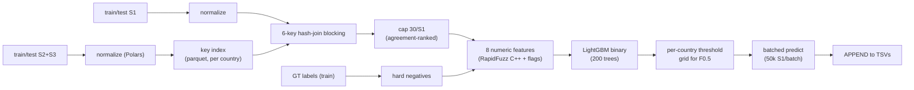

<div align="center">


<br>

[](https://github.com/Nikunjgoyal07/Amazon-ML-Challenge-2026)

<br>


[](https://skillicons.dev)

</div>

## 📌 What is this?

**Submission-1 is the CPU-only baseline**: lean 6-key lexical blocking → 8-feature LightGBM matcher → per-country F0.5 decisions. No GPU, no embeddings, no transformers — the whole pipeline runs in **~35 minutes on 4 CPUs / 15 GB RAM** and validates clean with the official validator.

| Item | Detail |
|---|---|
| 🏆 Leaderboard | **F0.5 = 0.580046** (macro-averaged, precision-heavy) |
| 🧱 Blocking | 6-key lexical hash-join, cap 30/S1 |
| 🌲 Matcher | LightGBM binary, 8 numeric features, 200 rounds |
| 📚 Training | 150k sampled S1 (~6.8% of train) → 4.15M pairs, 291k positives |
| ⏱️ Runtime | **~35 min** (index ~2 min · train 187 s · inference ~29 min) |
| 🖥️ Hardware | 4 CPU, 15 GB RAM — peak ~10 GB |
| ✅ Validation | `utils/validate_submission.py` → **PASS** |

## 🧩 The problem in one paragraph

Given deduplicated reference records (**Source 1**) and two noisy, duplicate-heavy sources (**Sources 2/3**) sharing only `business_name`, `business_address`, `country` (no common IDs), predict for **every** test S1 the list of matching S2/S3 records (possibly empty = singleton). Train covers **US + India**; test adds unseen **France**. Outputs are tab-separated: `matching_results.tsv` (scored) and `candidate_pairs.tsv` (blocking audit). Metric is **macro F0.5 per S1** — precision counts double, and a false match on a singleton scores 0.

## 🏗️ Architecture



Three scripts in [`src/`](src/):

| Script | Role |
|---|---|
| [`common.py`](src/common.py) | Normalization, blocking keys, stop-key masking, featurization (shared) |
| [`build_index.py`](src/build_index.py) | One-time S2/S3 key + token index → parquet |
| [`train.py`](src/train.py) | Sample → block → label → LightGBM + threshold tuning |
| [`infer.py`](src/infer.py) | Full test inference, constant-memory append loop |

## 🔑 Blocking (candidate generation)

**Why it matters:** blocking sets the recall ceiling. Measured on a 2k-S1 train probe:

| Stage | Recall@30–40 |
|---|---|
| Single exact keys (first-token / house-no / prefix) | ~0.32–0.39 each |
| Naive union, capped by key priority | 0.155 (junk single-key matches evict true ones — fixed by agreement ranking → 0.30) |
| \+ any-token join (word reorder, DBA/prefix noise) | 0.39 |
| **\+ consonant-skeleton key (vowels stripped — typos, transliteration)** | **0.578 @ 40** |

**The 6 keys** (all joined per-country, never cross-country):

1. `pin` — 5–6 digit postcode (rare, high precision)
2. `hnum` — first number in address (covers `1795 Westchester`, `KH NO 570`, `5 bis Rue`)
3. `first_tok` — first name token, len ≥ 3
4. `nprefix` — first 4 chars of spaceless name
5. `tok` — **any** significant name token, len ≥ 4 (exploded inverted index)
6. `phon` — first 8 chars of consonant skeleton (name minus `aeiou`, spaceless)

**Anti-explosion guards:** keys occurring >2,000× per country are nulled (699 hnum / 541 first-token / 788 prefix / 1,220 any-token stop keys on train — these are `1`, `private`, `limited`, …). Candidates ranked by **multi-key agreement** (`nkeys` desc, key-priority asc), capped at **30/S1** → ~28.2 cands/S1 on test, 3.5% S1 with zero candidates.

**Unicode:** cleaning keeps `\p{L}\p{M}\p{N}` so Devanagari (`राम मार्केटिंग`) and French accents survive; earlier `[a-z]`-only cleaning emptied native-script names.

## 🌲 Matcher

8 numeric features per pair — 3 RapidFuzz C++ scores (`name ratio`, `name token_set_ratio`, `address ratio` via 1-to-1 zip loop, no Python-level UDFs) + 3 exact flags (`pin/hnum/first-token match`) + 2 length diffs.

**LightGBM** (`num_leaves 63`, `min_data_in_leaf 200`, `feature_fraction/bagging 0.9`, 200 rounds, 4 threads) trained on **873,969 rows** (291k positives + 2:1 downsampled hard negatives from the blocker's own output). Same-sample per-country threshold grid `[0.3…0.8]` for F0.5 → **0.7 for US and India** (train F0.5: US 0.971, India 0.942 — optimistic, same-sample). France (unseen in train) falls back to 0.5; unknown future country labels fall back to all-shard blocking + 0.5 (open-set safe, no hard-coded country list).

## ⚡ Efficiency design (why it fits in 1 hour / 15 GB)

* **Polars everywhere** — earlier pandas `apply` attempts took 6+ hours for <10% of data. All normalization/joins run in Rust; `scan_csv` streams, `sink_parquet` persists the index once.
* **Batching** — train in 6×25k-S1 chunks; inference in 35×50k-S1 batches. Index partitioned by country once, so each join hashes ≤6M rows instead of 10M (the full-join version OOM-died silently mid-run).
* **Append outputs** — each batch appends via `quote_style="never"` TSV (header once); memory stays flat (~10 GB peak) and a crash never loses prior batches.
* **No embeddings/transformers** — no FAISS/GPU on this box; lexical + GBDT is the whole budget.

| Phase | Wall time |
|---|---|
| Index build (train + test, incl. token explosion) | ~2 min (one-time) |
| Train (150k S1 → 4.15M pairs → fit + tune) | **187 s** |
| Inference (1,732,544 test S1, 47.6M pairs) | **1,750 s (~29 min)** |

## 📦 Outputs & validation

* `output/matching_results.tsv` (74 MB): 1,732,544 rows, 336,706 empty (19.4% predicted singletons), mean **3.01** matches/non-empty S1 (train GT: 3.46), max 11 — distribution mirrors ground truth.
* `output/candidate_pairs.tsv` (601 MB): 1,732,544 rows, 60,578 empty, mean 28.2 candidates; final matches verified ⊆ candidates.
* `python3 utils/validate_submission.py --matching output/matching_results.tsv --candidate output/candidate_pairs.tsv --test-dir dataset/test` → **PASS, no blocking issues.**

## 🚀 Reproduce

```bash
pip install -r requirements.txt          # polars 1.44.2 · lightgbm 4.7.0 · rapidfuzz 3.14.6 · scikit-learn 1.9.1

python3 src/build_index.py train   # S2/S3 train index -> /tmp/opencode/
python3 src/build_index.py test    # S2/S3 test index
python3 src/train.py               # model -> /tmp/opencode/lgbm.txt, thresholds.pkl
python3 src/infer.py               # outputs -> output/*.tsv (append mode)

python3 utils/validate_submission.py --matching output/matching_results.tsv \
    --candidate output/candidate_pairs.tsv --test-dir dataset/test
```

> Intermediates live in `/tmp/opencode/` (pre-approved scratch); only `output/*.tsv` are submission artifacts. `SEED=42` throughout.

## 🧭 Known limits & next steps

* Blocking ceiling ≈ 58% recall — cross-script pairs (Devanagari ↔ romanized) and heavy-typo pairs share no exact key; a fine-tuned multilingual encoder (e.g. `multilingual-e5-small`, MIT) as an additional dense retriever is the highest-value upgrade if GPU/FAISS becomes available → that's exactly what **submission-2** does.
* Singleton rate predicted (19.4%) > train (5.6%) — threshold 0.7 is conservative; per-S1 expected-F0.5 subset selection on calibrated out-of-fold probs would sharpen this.
* No cross-encoder re-rank, no S2↔S3 consistency cleanup — both are cheap precision wins for F0.5 on top of the current outputs.

---

<div align="center">

*Libraries: LightGBM (MIT) · RapidFuzz (MIT) · Polars (MIT) · scikit-learn · SciPy — all within the competition's license rules.*

</div>
