<div align="center">


<br>

[](https://github.com/Nikunjgoyal07/Amazon-ML-Challenge-2026)

<br>


[](https://skillicons.dev)

</div>

## 📌 What is this?

**Submission-2 is the first leaderboard submission that beats the lexical baseline by a mile**: replace hand-made blocking keys with `multilingual-e5-small` dense retrieval (top-30 buckets + three extra searches), then judge every pair with a **61-feature LightGBM matcher** under a one-owner-per-record rule. Public leaderboard **F0.5 = 0.935** (vs 0.58 for submission-1).

| Item | Detail |
|---|---|
| 🏆 Public score | **F0.5 = 0.960** (0.96004; the earlier 44-feature e5 run scored 0.935) |
| 🔍 Retrieval | e5-small, top-30/S1 + reverse + address-key + name 3-gram searches |
| 🌲 Matcher | LightGBM, **61 features**, 3-fold S1-grouped CV, cutoff t = 0.70 |
| 📝 Text | `name_norm \| addr_norm`, Indian scripts transliterated via anyascii |
| 🖥️ Hardware | GPU T4 x2 for embeddings (~1 h) · CPU for matching (~1–2 h) |
| 🛟 Recovery | `03b_predict_only.ipynb` re-runs prediction after a Kaggle OOM |

## 🧠 Approach

Two upgrades over submission-1, and both matter:

1. **Dense blocking instead of lexical keys.** Every record is encoded with `intfloat/multilingual-e5-small` (118M params, 384-dim, `query: ` prefix, fp16 on 2×T4). Per country, exact nearest-neighbour search on mean-centered embeddings keeps each S1's **top-30** S2/S3 records. e5 compares name+address jointly, so three **extra candidate sources** patch its blind spots:
   - *Reverse search* — add the pair when the S1 is among the candidate's best-2 S1 (catches matches buried under lookalikes in crowded cities)
   - *Address key* — same house number + first street word (same address, garbled name)
   - *Name 3-grams* — top-5 TF-IDF character-3-gram name matches (same name, empty/different address, typos)
2. **Learned matcher instead of hand rules.** A 61-feature LightGBM scores each (S1, candidate) pair: embedding rank/similarity/gap, cross-S1 competition (how many buckets hold this candidate, is this S1 its best), name comparisons (edit distance, token-set/sort, Jaro-Winkler, transliterated, compact, phonetic, legal form), address comparisons (ratios, shared street tokens/numbers, postcode, house number, city/state), and flags (source, native script, website, empty address, honorific). **One owner**: each S2/S3 record is kept only for its highest-probability S1; pairs with p ≥ 0.70 survive.

```mermaid
flowchart LR
    A["processed/<br/>(01 output)"] --> B["e5-small encode<br/>(fp16, 2xT4)"]
    B --> C["exact top-30<br/>per country"]
    C --> D["+ reverse / address / name<br/>extra candidates"]
    D --> E["buckets/<split>_<country>.parquet"]
    E --> F["61 features/pair<br/>(RapidFuzz + rarity + flags)"]
    F --> G["LightGBM 3-fold CV<br/>tune cutoff t=0.70"]
    G --> H["predict test<br/>(PRED_PARTS shards)"]
    H --> I["one owner + p>=t"]
    I --> J["matching_results.tsv<br/>candidate_pairs.tsv"]
```



## 📁 Contents

| Notebook | Stage | What it does |
|---|---|---|
| [`preprocessing-2.ipynb`](preprocessing-2.ipynb) | 01 · EDA + cleaning | Full EDA + normalization → per-country parquet (`FULL_RUN=true`); sample mode otherwise |
| [`embedding-2.ipynb`](embedding-2.ipynb) | 02 · Buckets | e5 embed all ~24M records → top-30 + extra candidates → `buckets/` + `bucket_recall_train.csv` (ceiling report) |
| [`lightgbm-submission-2.ipynb`](lightgbm-submission-2.ipynb) | 03 · Matcher | Train on 200k S1/country → CV + cutoff → final model → predict test → write + validate both TSVs |
| [`03b_predict_only.ipynb`](03b_predict_only.ipynb) | 03b · Recovery | **No retrain**: loads saved model, recomputes identical 61 features (sparse-matrix fast paths, bit-identical), predicts per-country in `PRED_PARTS` shards — the fix for the Kaggle OOM on India |

## 🚀 Run order (Kaggle)

```bash
# 1) 01 — CPU, FULL_RUN=true  → processed/  (train_s1_*.parquet … test_s2/s3_*.parquet)
# 2) 02 — GPU T4 x2, internet on (downloads e5-small) → embeddings_full/.../buckets/
#    defaults: TOP_K=30, TEXT_MODE=fixed, EXTRA_SOURCES=reverse,address,name
# 3) 03 — CPU, attach data + processed/ + buckets/ → submission/output/*.tsv
#    defaults: TRAIN_S1_PER_COUNTRY=200000, CANDIDATES_PER_S1=30, FEATURE_SET=all
# 3b) only if 03 OOMs mid-prediction — attach 03's partial output and run 03b instead
```

Settings live in each notebook's first cell and can also be passed as environment variables (`TOP_K`, `EXTRA_SOURCES`, `CANDIDATES_PER_S1`, `TRAIN_S1_PER_COUNTRY`, `COUNTRY_THRESHOLDS`).

## 📊 Results & checks

* **Bucket ceiling (train report):** share of true matches inside the buckets — the perfect-matcher upper bound; compare `e5 top-30` vs `+ all extra (saved)` per country.
* **CV table:** row *"LightGBM p ≥ t + one owner"* ≈ expected India+US leaderboard score (v1: 0.946).
* **France sanity table:** % S1 matched + matches/matched S1 per country (v1: France 95.8% × 3.67 vs US 94.1% × 3.52 — France over-predicts on lookalikes, the reason v3+ tightens its cutoff).
* **Validator:** `validate_submission.py` must print `PASS`; matches ⊆ candidates is asserted in-notebook.

## 🧭 Limits → what came next

* India's search still misses Indian-script and empty-address matches (17% vs 4% miss rate) → **submission-3** experiments with a hybrid IndicXlit transliteration engine.
* 61 features → 85 (street, typo-tolerant rarity, candidate-vs-candidate, found-by ranks), 3 extra searches → 5 (number key, empty-address search), learned 370-word map → **submission-4**.
* e5's general tokenizer stays the weak spot → **submission-5** trains a from-scratch `er-embed-small` on this data (recall@10 0.92 → 0.99).

---

<div align="center">

*Models: `multilingual-e5-small` (MIT) · LightGBM (MIT) · Libraries: sentence-transformers (Apache-2.0), RapidFuzz (MIT), anyascii (ISC).*

</div>
