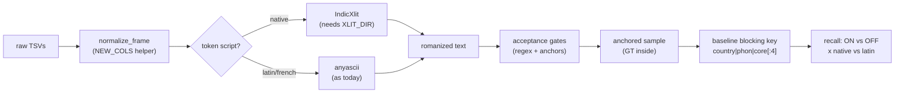

<div align="center">


[](https://github.com/Nikunjgoyal07/Amazon-ML-Challenge-2026)


[](https://skillicons.dev)

</div>

## 📌 What is this?

**Submission-3 is the transliteration-upgrade experiment track**: Indian-script names are the search stage's weakest slice (17% of true matches missed vs 4% for Latin script), so this folder tests a **hybrid transliteration engine** — IndicXlit for native-script tokens, anyascii for Latin/French — behind strict acceptance gates, plus **anchored dev sampling** so recall numbers are honest. No leaderboard score is claimed here; winners graduate into the main pipeline (see `docs/hybridplanner.md`).

| Item | Detail |
|---|---|
| 🎯 Goal | Close the 17%-vs-4% miss gap on Indian-script true matches |
| 🔤 Engine | Hybrid: IndicXlit (Devanagari/Telugu/Tamil/…) + anyascii (Latin/French) |
| 🛡️ Safety | `XLIT_DIR` unset → engine fully disabled, byte-identical baseline |
| 📐 Method | Anchored sampling (GT matches guaranteed inside the sample) |
| 📊 Test | Simple `country \| phonetic \| core_name[:4]` blocking stand-in, ON vs OFF × native vs Latin |

## 🧠 Approach

Three ideas, each fixing a real trap from earlier experiments:

1. **Hybrid transliteration.** anyascii romanizes Indian scripts crudely (`praivet limited` for प्राइवेट लिमिटेड). Routing native-script tokens through a pure-torch port of **IndicXlit** while keeping Latin/French on anyascii should produce spellings closer to how the S1 side writes them — raising name similarity before any embedding is involved. The engine is a drop-in helper: with `XLIT_DIR` empty, `XLIT_MODEL is None` and every code path returns exactly today's output.
2. **Acceptance gates, run every time.** Regex probes always run; IndicXlit anchor checks run when a model is loaded. If any assert fails, stop and recheck the engine against the fairseq sources — never "fix" it by tweaking weights or thresholds. This keeps a transliteration experiment from silently corrupting the pipeline.
3. **Anchored sampling.** The old per-file sampler took `head(quota)` from S1 and S2/S3 *separately*, so a sampled S1's true matches often weren't in the S2/S3 sample at all — recall computed on that was meaningless. `build_anchored_sample` guarantees each sampled S1's GT matches land inside the sample, so ON-vs-OFF recall deltas are real.



## 📁 Contents

| Notebook | What it does |
|---|---|
| [`preprocessing-3.ipynb`](preprocessing-3.ipynb) | 01 preprocessing with sample controls (`SAMPLE_SIZE` 40k default · `SAMPLE_MODE` linked/random/head · `PROCESSED_OUT`), full EDA always on all rows |
| [`amazon-ml (2).ipynb`](<amazon-ml%20(2).ipynb>) | Preprocessing + **hybrid transliteration engine** + anchored sampling + baseline blocking recall (hybrid ON vs OFF, native-vs-Latin split) |

Sample modes: `linked` (S1 sample + their true S2/S3 matches first, then distractors — real pairs to learn from) · `random` · `head` (fastest, almost no pairs).

## 🚀 Run

```bash
# byte-identical baseline (default — no model assets needed)
# Run all: FULL_RUN=true for the real processed/ ; sample settings otherwise

# hybrid engine experiment (needs the unzipped indicxlit assets)
XLIT_DIR=/path/to/indicxlit-assets  # unset/empty => hybrid disabled, nothing changes
```

> Test files must be processed with `FULL_RUN=true` before any final submission — every test entity must be present regardless of dev-time sampling.

## 📊 How to read the result

* **Native-script recall delta (ON − OFF)** is the only number that matters; Latin-slice recall must not drop.
* The blocking key here is a deliberately simple stand-in for notebook 02's embedding search — fast enough to iterate, good enough to tell whether hybrid transliteration moves recall *before* wiring it into the expensive stage.
* Promotion rule (from the planner): only a clear, gated, anchored win gets merged into `02_full_e5_buckets`'s transliteration path.

## 🧭 Where it fits

* Builds on **submission-2**'s pipeline (anyascii transliteration + word map).
* Successor ideas live in `docs/hybridplanner.md`; the from-scratch tokenizer of **submission-5** ultimately attacks the same weakness from the model side.

---

<div align="center">

[](https://github.com/Nikunjgoyal07/Amazon-ML-Challenge-2026)

*Engine sources: IndicXlit (fairseq-based) · anyascii (ISC) · Polars (MIT).*

</div>
