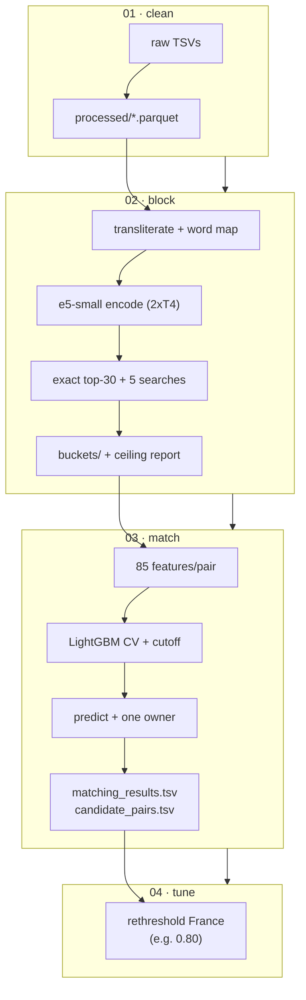

<div align="center">


[](https://github.com/Nikunjgoyal07/Amazon-ML-Challenge-2026)

<br>


[](https://skillicons.dev)

</div>

## 📌 What is this?

**Submission-4 is the full, current v3 pipeline** — every notebook that produces a leaderboard file, plus the sample-scale twins used for experiments. It takes submission-2's system and adds: two transliteration fixes + a learned **370-word map**, **two new candidate searches** (number key, empty-address), **8 typo-tolerant + 13 candidate-vs-candidate features** (61 → 85), and a **France rethreshold** notebook. Test-bed ceiling: India 0.967 → **0.974**.

| Item | Detail |
|---|---|
| 🎯 Test-bed ceiling | India recall 91.4% → **93.3%**, ceiling 0.967 → **0.974** |
| 🔍 Retrieval | e5-small top-30 + **5** extra searches (reverse, address, name, number🇮🇳, empty-address) |
| 🌲 Matcher | LightGBM, **85 features**, 3-fold CV, one owner, tuned cutoff ~0.65–0.70 |
| 🔤 Text | `fixed` mode + anyascii fixes (`റ്റ→tt`, nasal→`n`) + learned word map |
| 🇫🇷 France | Unlabeled → tuned on leaderboard via `04_rethreshold` (e.g. 0.80) |
| 🧪 Doubles | `02_e5_embeddings` / `03_lightgbm_matcher` = sample-scale experiment twins |

## 🧠 Approach (what changed vs submission-2)

1. **Better transliteration.** Two anyascii fixes (Malayalam `റ്റ→tt`, nasal dot→`n`) lifted Indian-script name similarity 71.9 → 75.1; a **~370-word map** learned from train true pairs sends transliterated words back to English (`praivet→private`, `solyusns→solutions`) — Hindi name similarity 76 → 91. Saved as `translit_wordmap.json`, shared by 02 and 03.
2. **Two new candidate searches.** *Number key* (India): shared number + address word catches chopped addresses (`Door No 206, Pune`) the street-word key can't — +22.6K misses for 3.9 pairs/S1. *Empty-address search*: name search restricted to address-less candidates — 38.6% of those misses for ≤1.8 pairs/S1. Both beat enlarging top-k (30→50 costs 20 pairs/S1) by 4–10× per pair.
3. **24 new features (61 → 85).** *Typo-tolerant word rarity* (typo-neighbour words count as shared: 0.9667 → 0.9675) and *candidate-vs-candidate* (how far behind the bucket's best on address/street/name; near-duplicate counts — cross-country +0.003). Country is **not** a feature, so the model transfers to France.
4. **France cutoff on the leaderboard.** `04_rethreshold` rewrites matches from saved probabilities with per-country cutoffs in minutes — no recompute.



## 📁 Contents

| Notebook | Stage | Role |
|---|---|---|
| [`01_eda_preprocessing.ipynb`](01_eda_preprocessing.ipynb) | 01 · full | EDA + clean every record → `processed/` (`FULL_RUN=true`, CPU) |
| [`02_full_e5_buckets.ipynb`](02_full_e5_buckets.ipynb) | 02 · full | Embed ~24M records (T4 x2) → top-30 + 5 searches → `buckets/` + recall report (~1.5–2 h) |
| [`03_full_lightgbm_submission.ipynb`](03_full_lightgbm_submission.ipynb) | 03 · full | 85 features, train 200k S1/country → CV + cutoff → predict → validate (~3–4 h CPU) |
| [`04_rethreshold.ipynb`](04_rethreshold.ipynb) | 04 · tune | New per-country cutoffs from saved probabilities (minutes) |
| [`02_e5_embeddings.ipynb`](02_e5_embeddings.ipynb) | 02 · sample | Experiment twin: IVF-PQ vs exact, model bake-offs (`small,base,large`), `SAMPLE_SIZE` in one place |
| [`03_lightgbm_matcher.ipynb`](03_lightgbm_matcher.ipynb) | 03 · sample | Experiment twin: 44+7 features, `BUCKETS=all/sub2/e5` comparisons, `show_s1()` viewer, transfer check |

Sample twins are for experiments only — never for a submission (small-sample scores mislead: 0.974 vs 0.946 real).

## 🚀 Run order (Kaggle)

```bash
# 1) 01 with FULL_RUN=true  → processed/            (CPU; reuse if test_s2/s3 present)
# 2) 02_full, GPU T4 x2, internet on → embeddings_full/.../buckets/  (~1.5–2 h)
#    TOP_K=30 · TEXT_MODE=fixed · EXTRA_SOURCES=reverse,address,name,number,empty
# 3) 03_full, CPU  → submission/ (matching_results.tsv, candidate_pairs.tsv)  (~3–4 h)
#    TRAIN_S1_PER_COUNTRY=200000 · FEATURE_SET=all · PRED_PARTS=8
# 4) 04 optional: COUNTRY_THRESHOLDS={"France": 0.80} → rethreshold/  (minutes)
# validate: python ../submission-1/utils/validate_submission.py --matching ... --candidate ... --test-dir dataset/test --check-ids  # PASS
```

OOM? lower `TRAIN_S1_PER_COUNTRY`/`PAIRS_PER_CHUNK`; too slow? `CANDIDATES_PER_S1=20` (≈⅓ less work, −0.003 local).

## 📊 Scoreboard (traceable to `docs/`)

| Version | Change | Score |
|---|---|---|
| v1 | 44 feat, 20 cand | public **0.935** |
| v2 | transliteration + street/rarity/frequency, 30 cand | test bed 0.943 → **0.967** |
| **v3 (here)** | +2 searches, word map, typo + c-vs-c features | ceiling **0.974**; CV ≈ 0.96 expected |

Design docs: `docs/ARCHITECTURE.md` (method) · `docs/SUBMISSION_STEPS.md` (runbook) · `docs/RESULTS_EXPLAINED.md` (reading the tables) · `docs/DATA_AND_OUTPUTS.md` (every artifact).

## 🧭 Limits

* France ≈ 0.88, never seen in training (cross-country check loses 0.04–0.06) — leaderboard cutoff tuning is the remaining lever.
* India's search still misses some empty-address / random-word renames — the next retriever upgrade is **submission-5**'s custom `er-embed-small`.

---

<div align="center">

[](https://github.com/Nikunjgoyal07/Amazon-ML-Challenge-2026)

*Models: `multilingual-e5-small` (MIT) · LightGBM (MIT) · FAISS (sample compare) · Libraries: sentence-transformers (Apache-2.0), RapidFuzz (MIT), anyascii (ISC).*

</div>
