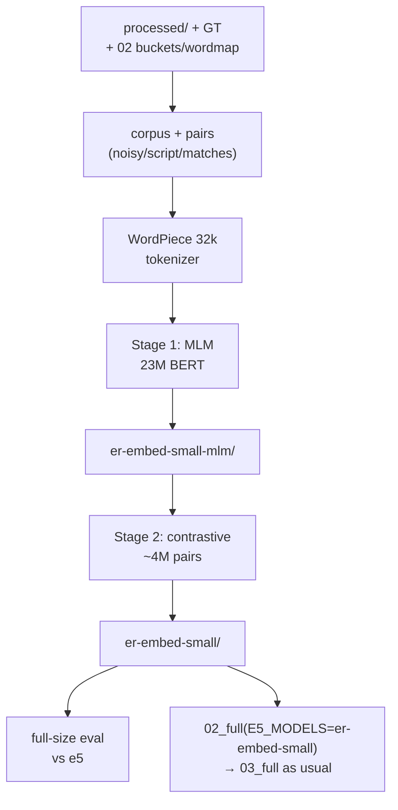

<div align="center">


[](https://github.com/Nikunjgoyal07/Amazon-ML-Challenge-2026)

<br>


[](https://skillicons.dev)

</div>

## 📌 What is this?

**Submission-5 stops borrowing e5 and trains our own embedding model from zero — on this data only.** A 23M-parameter BERT (6 layers × 384 wide) with its own 32k WordPiece tokenizer learns shop language via masked-LM school, then contrastive practice on ~4M true/noisy/script pairs. The result, `er-embed-small`, drops into `02_full` wherever e5-small went. Full plain-language deep dive: **[WWMD.md](WWMD.md)**.

| Item | Detail |
|---|---|
| 🏋️ Stage 1 (school) | MLM on 9.6M texts, 9,378 steps, ~21 min, 2×T4 — loss 8.04 → 2.75 |
| 🥊 Stage 2 (practice) | Contrastive, batch 512, lr 1e-4, ~89 min — loss 1.42 → 0.02 |
| 🔤 Tokenizer | WordPiece 32k from 3M shop texts (`pvt`, `nagar`, `sarl`, Indic scripts, `é`) |
| 📈 India recall@10 | all 0.9219 → **0.9872** · Indian-script 0.9063 → **0.9981** · empty-addr 0.3505 → **0.9111** |
| 🔌 Use | `02_full` with `E5_MODELS=…/er_embed/er-embed-small`, then `03_full` as usual |
| ⏱️ Full run | ~3–4 h (prep ~30′ · stage-1 ~45′ · stage-2 ~60′ · eval ~30′); `QUICK_RUN=true` ≈ 15–20′ |

## 🧠 Approach

1. **Same text e5 sees** (`query: name | address`, transliteration + 370-word map) **plus** `native_text` — each Indian-script record also kept in its original script, so the model learns both writings are one shop.
2. **Own tokenizer.** e5's general tokenizer shreds shop words and Indic scripts; a 32k WordPiece learned from these records gives whole tokens to `pvt/ltd/nagar/sarl/rue` and full Indic + French alphabets.
3. **Stage 1 — MLM school.** 15% of tokens hidden (80% `[MASK]` / 10% random / 10% kept), predicted through a head tied to the input embeddings. Contrastive learning from random weights learns poorly — MLM first teaches words, scripts, spelling variants. (`stage1_mlm.py`, DDP one process/GPU, fp16, AdamW, 6% warm-up → linear decay.)
4. **Stage 2 — contrastive practice.** `MultipleNegativesRankingLoss` (cached over 256/GPU), cosine × 20: each anchor must beat every other row in its 512-row step. Pair menu per country — `matches` (1M true + bucket hard negatives, India/US, **never** LightGBM's 200k S1), `noisy` (500k/country, typo/abbreviation/drop/reorder/website noise — France's *only* signal), `script` + `script_matches` (300k each, India). (`stage2_contrastive.py`, `NO_DUPLICATES` + `PROPORTIONAL` batching.)
5. **Full-size exam.** 02-style exact search on mean-centered vectors; 20k *unseen* S1 (LightGBM's set — the number that transfers to test) + 5k *seen* (memorization check), sliced by record kind.



## 📁 Contents

| Path | What it is |
|---|---|
| [`pretrain-embedding-model.ipynb`](pretrain-embedding-model.ipynb) | The whole pipeline, 23 cells (settings → pairs → tokenizer → stage-1 → stage-2 → eval) |
| [`PRETRAIN-embed/er_embed/er-embed-small/`](PRETRAIN-embed/er_embed/er-embed-small/) | ✅ **The trained model** (SentenceTransformer format, drop-in for 02_full) |
| [`PRETRAIN-embed/er_embed/er-embed-small-mlm/`](PRETRAIN-embed/er_embed/er-embed-small-mlm/) | Stage-1 checkpoint + tokenizer (`MLM_MODEL=` resumes from here) |
| [`PRETRAIN-embed/er_embed/stage1_mlm.py`](PRETRAIN-embed/er_embed/stage1_mlm.py) / [`stage2_contrastive.py`](PRETRAIN-embed/er_embed/stage2_contrastive.py) | Standalone training scripts (also embedded in the notebook) |
| [`PRETRAIN-embed/er_embed/eval_recall.csv`](PRETRAIN-embed/er_embed/eval_recall.csv) | Recall@5/10/30: ours vs e5, overall + by slice |
| [`PRETRAIN-embed/er_embed/mlm_log.csv`](PRETRAIN-embed/er_embed/mlm_log.csv) / [`contrastive_log.csv`](PRETRAIN-embed/er_embed/contrastive_log.csv) / [`embed_config.json`](PRETRAIN-embed/er_embed/embed_config.json) | Loss curves + full settings record |
| [`PRETRAIN-embed/er_embed/lgbm_train_s1.txt`](PRETRAIN-embed/er_embed/lgbm_train_s1.txt) / [`matches_s1.txt`](PRETRAIN-embed/er_embed/matches_s1.txt) / [`translit_wordmap.json`](PRETRAIN-embed/er_embed/translit_wordmap.json) | No-leakage receipts: LightGBM's S1 (never trained on) vs ours |
| [`WWMD.md`](WWMD.md) | 📖 Extreme-detail plain-language companion (What/Why/How/Measure/Do) |

## 🚀 Use it (no retraining)

```bash
# 1) upload er_embed/ as a Kaggle dataset, then
# 2) 02_full with:
E5_MODELS=/kaggle/input/<dataset>/er_embed/er-embed-small
#    buckets land in embeddings_full/er-embed-small/buckets/
# 3) 03_full with:
BUCKET_DIR=<that run>/embeddings_full/er-embed-small/buckets
#    keep TRAIN_S1_PER_COUNTRY=200000, SEED=42  (must match lgbm_seed)
# 4) compare 03's CV (0.9796 with e5-small) and 02's train report
```

Retraining needs: 01's `processed/` (`FULL_RUN=true`) · `train_ground_truth.tsv` · 02_full's `buckets/` + `translit_wordmap.json` (recommended) · T4 x2 + internet · `MLM_MODEL=` / `TRAINED_MODEL=` shortcuts for stage skips. Settings table + reading guide are in the notebook's first cells and **[WWMD.md](WWMD.md)**.

> ⚠️ Test *text* (no labels) trains the tokenizer/MLM/noisy pairs — without it the model never sees French. Same class of use as 03's word rarity; check competition rules before submitting. `USE_TEST_TEXT=false` = train text only.

## 🧭 Limits

* France has no labels — noisy copies are a guess at real noise; only the full pipeline + leaderboard can judge it.
* If recall lands below e5: scale up either stage (`MLM_TEXTS_PER_COUNTRY`, `PAIRS_PER_COUNTRY`) or the model (`LAYERS=12`); rerun stage-2 alone from `MLM_MODEL=`.

---

<div align="center">

[](https://github.com/Nikunjgoyal07/Amazon-ML-Challenge-2026)

*Stack: PyTorch · Transformers · sentence-transformers 5.4.1 · tokenizers (WordPiece) · datasets · RapidFuzz · anyascii (ISC). All models trained from this data; comparison download `multilingual-e5-small` (MIT) is eval-only.*

</div>
